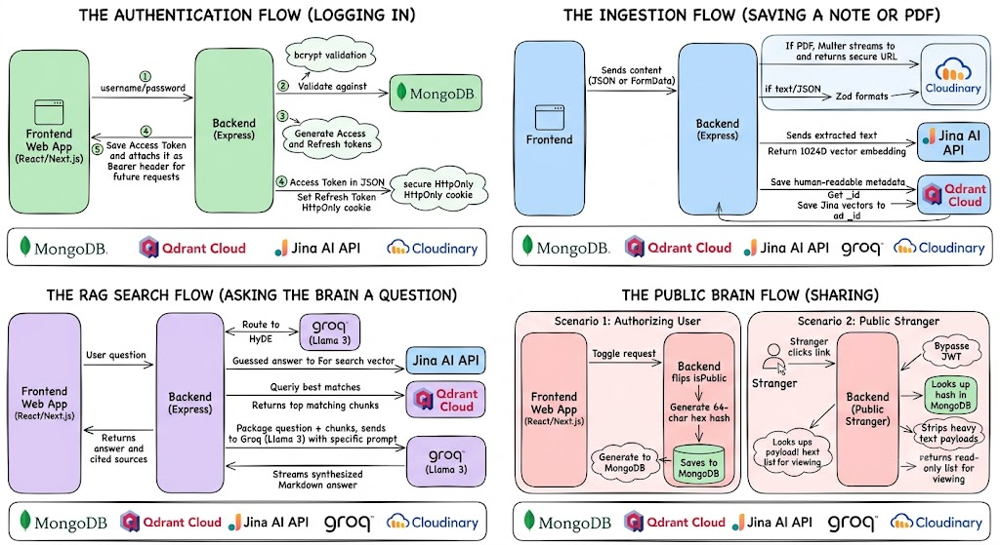

<!--  -->

# Friday

**AI "Second Brain" & Personal Knowledge Management platform**

---

## 📖 Executive Summary & Problem Statement

**Friday** is a high-performance Personal Knowledge Management (PKM) platform designed as a secure, production-grade AI-powered "Second Brain." It empowers individuals and enterprises to instantly ingest, organize, and query vast amounts of fragmented digital knowledge. 

**The Problem:** Our digital context is siloes across multiple apps and formats, from raw notes to web links and complex PDFs, making it impossible to synthesize and act upon critical information. While foundational LLMs are powerful reasoning engines, they cannot access this personal context, resulting in generic answers and high hallucination rates. Friday solves this by providing a unified, production-ready Multi-Modal Ingestion Pipeline and a Grounded RAG Generation engine, allowing organizations to securely deploy and ground state-of-the-art inference on their private datasets as a powerful PKM SAAS.

## ✨ Features & Methodology

Friday features a clean, benefit-focused set of core competencies:

*   ✨ **Multi-Modal Ingestion:** Instantly ingest, parse, and organize raw notes, web articles, tweets, YouTube videos, and PDFs into a unified knowledge base.
*   ✨ **Context-Aware AI Chat:** Friday enables you to chat directly with your digital knowledge. It retrieves the most relevant content and synthesizes precise, cited answers using state-of-the-art LLMs.
*   🛡️ **Enterprise-Grade Security:** A production-ready architecture featuring stateful dual-token authentication (XSS/CSRF mitigation), granular Broken Object Level Authorization (BOLA) protection, and API-quota-protecting rate limits.
*   🧠 **Secure "Public Brain" Sharing:** Securely toggle your private knowledge base to public and generate a read-only, rate-limited, cryptographic sharing link for easy knowledge exchange.

## 🏗️ Architecture & Data Flows

The following diagram illustrates the complete, self-contained architecture of the Friday platform, covering Authentication, Multi-Modal Ingestion, Context-Aware RAG Search, and Cryptographic Public Sharing as an integrated PKM solution.

  
  
<em>Figure 1: Complete Friday Platform flows covering Authentication, Multi-Modal Ingestion, Context-Aware RAG Search, and Secure Public Sharing.</em>

## 🧠 Key Technical Decisions

Friday makes strategic technical choices for performance, security, and scalability:

*   **HyDE (Hypothetical Document Embeddings):** By generating a hypothetical answer to a user's prompt before querying the vector space, we shift the search metric from "question similarity" to "answer similarity," drastically increasing recall and grounded correctness for complex queries.
*   **Stateful Dual-Token Auth Architecture:** A production-ready dual-token authentication system (using in-memory access tokens and `HttpOnly`, `SameSite=Strict` cookies) mitigates common web vulnerabilities like XSS and CSRF.
*   **Decoupled Multi-Modal Ingestion:** The architecture decoupled I/O-heavy PDF blob storage to Cloudinary from compute-heavy vectorization and metadata storage to Qdrant/MongoDB, preventing ingestion bottlenecks from affecting core chat performance.
*   **Synchronous Defensive Boot Sequence:** We enforce a strict synchronous dependency check upon boot (db/Qdrant connectivity), allowing the server to fail fast in production orchestration environments if external services are unreachable.

## 💻 Tech Stack

| Category | Technologies |
| :--- | :--- |
| **Runtime & Framework** | Node.js (ES Modules), Express.js |
| **AI / Machine Learning** | Groq API (Llama 3 70B), Jina Embeddings (1024-d) |
| **Databases** | MongoDB (State/Metadata), Qdrant Cloud (Vectors) |
| **Storage & Parsing** | Cloudinary (PDF Blobs), Multer, Zod |
| **Security & Validation** | jsonwebtoken, bcrypt, Helmet, express-rate-limit |

Author
Rajveer Singh

Computer Science & Engineering

NIT Raipur

⭐ If you find this project useful, please consider giving it a star on GitHub!

